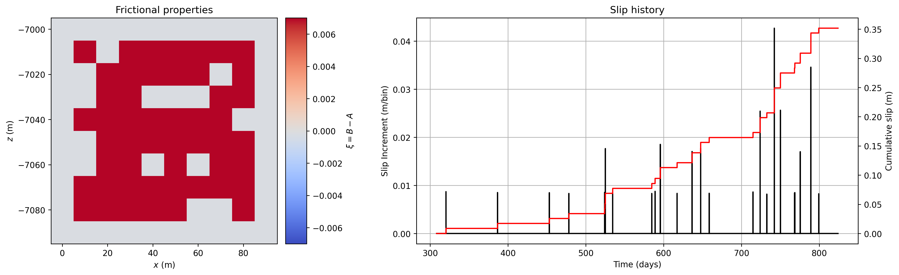

# eqsimulator

Earthquake simulator using inter-connected rate-and-state spring-sliders with long range elastic interactions (RSQSim).

    

!!!! WORK-IN-PROGRESS !!!! 
I am currently working on writing the doc strings and cleaning up the functions that I haven't used in a long time.
